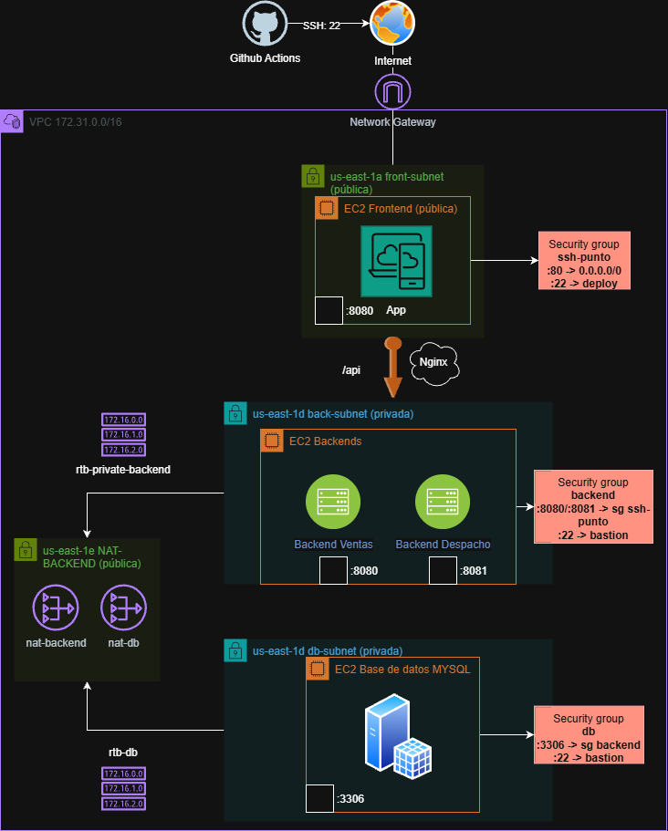

# Frontend — EV. Devops

Aplicación web **React + Vite** servida por **nginx**, contenerizada con Docker y
desplegada de forma automatizada mediante GitHub Actions. Las imágenes se publican
en **Amazon ECR** y el frontend corre como **task de ECS Fargate** en una subred
pública. Es el único componente accesible desde Internet; consume las APIs del
backend (que viven en subredes privadas) vía proxy reverso de nginx.

## Repositorios del proyecto (3-tier)

- **Frontend:** https://github.com/AnthonyBAC/ev-third-year-devops-frontend
- **Backend:** https://github.com/AnthonyBAC/ev-third-year-devops-backend
- **Datos (DB):** https://github.com/AnthonyBAC/ev-third-year-devops-db

---

## Arquitectura



```
Internet ──► ECS Fargate Frontend (pública)     ECS Fargate Backend (privada)
             ┌────────────────────┐             ┌──────────────────┐
             │  nginx (no root)   │  /api/v1/   │  back-ventas:8080│
navegador ──►│  :8080 contenedor  │──proxy─────►│  back-despachos  │
             │  -> :8080 host     │  ventas      │      :8081        │
             │  sirve React build │  despachos  │                  │
             └────────────────────┘             └──────────────────┘
```

- nginx sirve los estáticos de React y hace **proxy reverso**:
  * `/api/v1/ventas` → `BACKEND_VENTAS_HOST:8080`
  * `/api/v1/despachos` → `BACKEND_DESPACHOS_HOST:8081`
- La IP privada del backend se inyecta en tiempo de arranque con **envsubst**.
- El backend no es accesible desde Internet: solo responde al Security Group del frontend.
- El frontend corre en **ECS Fargate** — sin gestión de servidores EC2.

---

## Estructura del repositorio

```
.
├── front_despacho/
│   ├── src/ ...            # código React/Vite
│   ├── nginx.conf          # config nginx (proxy a los backends, con envsubst)
│   └── Dockerfile          # build multi-stage, runtime nginx no root
├── docker-compose.yml      # levanta el frontend (uso local)
├── .env.example            # plantilla de variables para correr en local
└── .github/workflows/deploy.yml   # pipeline CI/CD
```

---

## Dockerfile (multi-stage + usuario no root)

1. **Etapa builder**: `node:22-alpine` instala dependencias (`npm ci`) y genera el
build de producción (`npm run build`).
2. **Etapa runtime**: `nginxinc/nginx-unprivileged:1.27-alpine`, que corre nginx como
**usuario no root** (principio de mínimo privilegio). Por eso nginx escucha en el
puerto **8080** dentro del contenedor, y el host lo publica en el **80** (`80:8080`).

nginx procesa automáticamente `nginx.conf` como plantilla, sustituyendo con
`envsubst` las variables de las IPs del backend al iniciar.

---

## Correr en local

```bash
cp .env.example .env      # completa BACKEND_PRIVATE_IP
docker compose up -d --build
docker compose ps
```

App disponible en http://localhost:80.

---

## Pipeline CI/CD (GitHub Actions)

Archivo: `.github/workflows/deploy.yml`. Se dispara con **push a la rama `deploy`**.

```
push a deploy
   │
   ├─ build-and-push
   │     1. checkout
   │     2. Configurar credenciales AWS
   │     3. Login en Amazon ECR
   │     4. build + push imagen front-despacho (tags :latest y :<sha>)
   │
   └─ deploy-frontend  (needs: build-and-push)
         1. checkout
         2. scp de docker-compose.yml al EC2 frontend
         3. ssh: login ECR + docker compose pull + docker compose up -d
```

El deploy **levanta el contenedor con `docker compose`** en la EC2 frontend,
usando la imagen ya publicada en ECR (no compila en la instancia).
ECS Fargate corre el task de forma independiente del pipeline.

### Secrets requeridos (Settings → Secrets and variables → Actions)

| Secret                 | Descripción                                              |
| ---------------------- | -------------------------------------------------------- |
| `AWS_ACCESS_KEY_ID`    | Access Key del Learner Lab (actualizar cada sesión)      |
| `AWS_SECRET_ACCESS_KEY`| Secret Key del Learner Lab (actualizar cada sesión)      |
| `AWS_SESSION_TOKEN`    | Session Token del Learner Lab (actualizar cada sesión)   |
| `EC2_USER`             | `ubuntu`                                                 |
| `EC2_SSH_PRIVATE_KEY`  | Clave privada SSH                                        |
| `EC2_HOST_FRONTEND`    | IP pública del EC2 frontend (actualizar si cambia)       |
| `BACKEND_PRIVATE_IP`   | IP privada del EC2 backend (destino del proxy nginx)     |

> **Nota:** Las credenciales AWS del Learner Lab expiran cada ~4 horas.
> En producción se usaría un IAM Role asignado directamente a la EC2.

---

## Registro de imágenes — Amazon ECR

Las imágenes se publican en:
```
211125593312.dkr.ecr.us-east-1.amazonaws.com/front-despacho:latest
211125593312.dkr.ecr.us-east-1.amazonaws.com/front-despacho:<sha>
```

El tag `:<sha>` permite rollback exacto a cualquier versión anterior.

---

## Orquestación — ECS Fargate

El frontend corre como **ECS Service** en el cluster `devops-ecs`:

| Parámetro        | Valor                        |
| ---------------- | ---------------------------- |
| Cluster          | `devops-ecs`                 |
| Service          | `svc-frontend`               |
| Task Definition  | `frontend`                   |
| Launch type      | Fargate                      |
| CPU / Memory     | 0.25 vCPU / 0.5 GB           |
| Subred           | front-subnet (pública)       |
| Security Group   | ssh-punto (:80 y :8080)      |
| Desired tasks    | 1                            |

ECS reinicia el task automáticamente si falla, sin intervención manual.

---

## Acceso desde el navegador

Entrar por **HTTP** a la IP pública del task Fargate frontend:
`http://<IP_PUBLICA_FARGATE>:8080`

> El puerto expuesto es **8080** porque nginx-unprivileged no puede bindear
> puertos menores a 1024 sin root. En producción se agregaría un
> Application Load Balancer escuchando en el 80 y redirigiendo al 8080.
